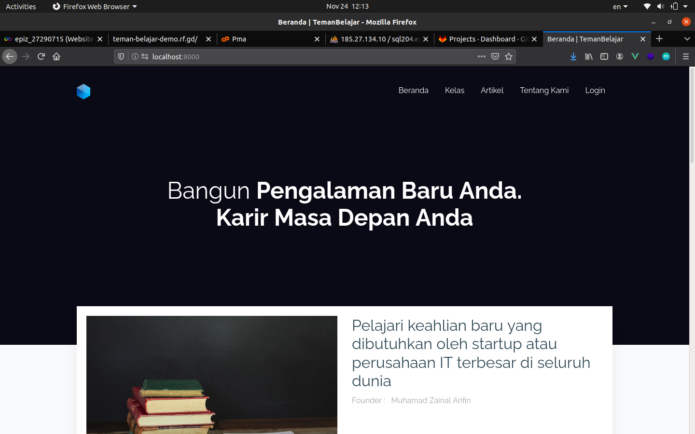
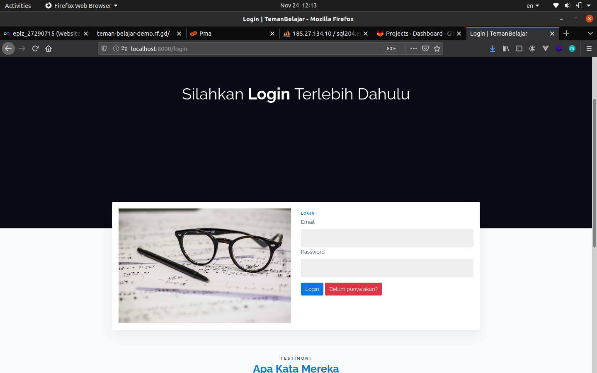
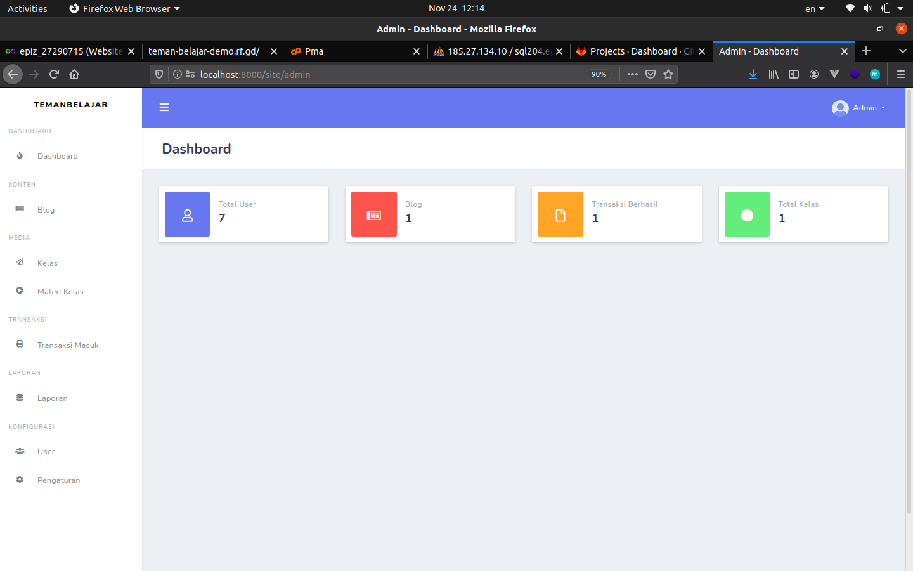

<p align="center"><a href="https://laravel.com" target="_blank"></a><a href="https://vuejs.org" target="_blank"></a></p>


<h1 align="center">
  Teman Belajar (Online Platform Learning System)
  <br>
</h1>            


# Introduce

Teman Belajar is an online learning platform where students can access material easily and get the latest learning materials

# Demo
- [http://teman-belajar-demo.rf.gd](http://teman-belajar-demo.rf.gd) 

# Overview






## Prerequiste

- [Composer](https://getcomposer.org/) - Download and Install Composer
- [Git](https://git-scm.com/) - Download and Install Git
- [NodeJS](https://nodejs.org/en/) - Download NodeJS or Package Manager for Javascript

### Installation

Install the dependencies and start the server.

```sh
$ git clone https://gitlab.com/zainal21/e-course-learning-system-laravue/
$ cd e-course-learning-system-laravue/
$ composer install
$ npm install or yarn install
$ cp .env.example to .env
$ change setting for database & generate key with php artisan key:generate or upload your .sql file to your DBMS
$ Call Action to Migrate Database & seeder with php artisan migrate --seed (skip this if you upload .sql file manually)
$ php artisan serve
```

## 👤 Author

-   Muhamad Zainal Arifin

## 📝 License

Copyright © 2020 Muhamad Zainal Arifin.
This project is MIT licensed.
